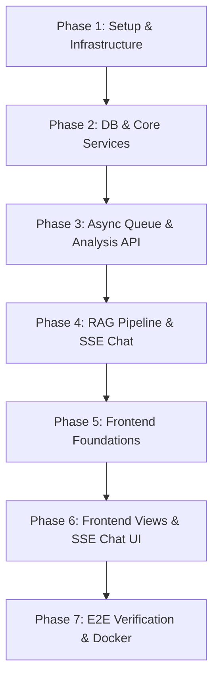

# 📝 VidIQ Comparator — Master Implementation Roadmap (TODO.md)

This document outlines the step-by-step implementation plan for the **VidIQ Comparator** application. To ensure a stable and debuggable development process, the project is broken down into **7 Phases**, subdivided into **Modules** with atomic, testable tasks.

Follow the roadmap **one module at a time**. Run verification checks before proceeding to the next step. Do not write full project code at once.

---

## 🗺️ Phase & Module Map



---

## 🛠️ Phase 1: Environment & Base Infrastructure
**Goal:** Initialize the project directories, setup configuration files, and launch local dependencies (MongoDB, Redis, Qdrant) via Docker.

### 📦 Module 1.1: Directories & Configuration Setup
*Set up the backend configuration, environment validation, and project folders.*

#### 📁 Module Folder Structure
```
vidiq-comparator/
├── backend/
│   ├── config/
│   │   ├── env.js           # Env validation using Zod
│   │   └── constants.js     # Global backend constants
│   ├── utils/
│   │   └── logger.js        # Winston logger configuration
│   ├── .env                 # Local secrets (ignored in git)
│   └── package.json         # Node.js dependencies configuration
├── docs/                    # (Pre-existing project documentation)
├── .env.example             # Template for environment variables
└── .gitignore               # Excludes node_modules, envs, logs
```

#### 🎯 Atomic Tasks
- [x] **Task 1.1.1:** Create `.gitignore` in the root directory to ignore `.env`, `node_modules/`, `logs/`, and frontend build artifacts.
- [x] **Task 1.1.2:** Initialize `backend/package.json` with ESM support (`"type": "module"`) and install dependencies:
  - Production: `express`, `mongoose`, `redis`, `bull`, `@qdrant/js-client-rest` (installed in place of `qdrant-sdk`), `openai`, `langchain`, `zod`, `dotenv`, `cors`, `helmet`, `winston`, `express-rate-limit`
  - Development: `nodemon`
- [x] **Task 1.1.3:** Create `.env.example` in the root containing placeholder values for `PORT`, `OPENAI_API_KEY`, `YOUTUBE_API_KEY`, `INSTAGRAM_ACCESS_TOKEN`, `MONGODB_URI`, `QDRANT_URL`, and `REDIS_URL`. Duplicate this file as `backend/.env` for local editing.
- [x] **Task 1.1.4:** Create `backend/config/env.js` to validate backend environment variables using **Zod** at startup and fail fast with detailed errors if anything is missing.
- [x] **Task 1.1.5:** Create `backend/utils/logger.js` to export a **Winston** logger instance configured with console transport and a structured file logger (`logs/app.log`).

#### 🔍 Verification Check
*Run `node backend/config/env.js` and verify it logs a Zod validation error if `.env` values are empty, or succeeds when environment variables are valid.*

---

### 📦 Module 1.2: Docker Compose & External Services
*Initialize MongoDB, Redis, and Qdrant locally.*

#### 📁 Module Folder Structure
```
vidiq-comparator/
└── docker-compose.yml       # Local services configuration
```

#### 🎯 Atomic Tasks
- [x] **Task 1.2.1:** Create `docker-compose.yml` defining three services:
  - **MongoDB** (image `mongo:7`, port `27017:27017`, volume `mongo-data`)
  - **Redis** (image `redis:7-alpine`, port `6379:6379`)
  - **Qdrant** (image `qdrant/qdrant`, port `6333:6333`, volume `qdrant-data`)
- [x] **Task 1.2.2:** Ensure backend config coordinates are set correctly in `backend/.env`:
  - `MONGODB_URI=mongodb://localhost:27017/vidiq`
  - `REDIS_URL=redis://localhost:6379`
  - `QDRANT_URL=http://localhost:6333`

#### 🔍 Verification Check
*Run `docker compose up -d` and ensure all containers start successfully. Verify you can access MongoDB (`localhost:27017`), Redis (`localhost:6379`), and Qdrant's Web Dashboard (`localhost:6333/dashboard`).*

---

## 🗄️ Phase 2: Database Schema & Core API Services
**Goal:** Establish database connectivity, define schemas, and build standalone mockable extraction/embedding modules.

### 📦 Module 2.1: Mongoose Collections & Schema Validation
*Implement schemas for persistent storage.*

#### 📁 Module Folder Structure
```
backend/
├── config/
│   └── db.js                # Database connection client
└── models/
    ├── Video.js             # Mongoose schema for Video metadata
    ├── Analysis.js          # Mongoose schema for Video Comparison metadata
    └── ChatHistory.js       # Mongoose schema for Chat sessions
```

#### 🎯 Atomic Tasks
- [x] **Task 2.1.1:** Implement `backend/config/db.js` to establish connection to MongoDB and export the connection status helper.
- [x] **Task 2.1.2:** Create Mongoose Model `backend/models/Video.js` according to `DatabaseSchema.md`. Ensure indexes are set for:
  - `analysisId` (for session search)
  - `videoId + platform` (unique compound index)
- [x] **Task 2.1.3:** Create Mongoose Model `backend/models/Analysis.js`. Configure `expiresAt` field with a Mongoose TTL index to automatically expire and clean up records after 30 days.
- [x] **Task 2.1.4:** Create Mongoose Model `backend/models/ChatHistory.js` with indexes on `sessionId` and `analysisId`.

#### 🔍 Verification Check
*Write a temporary test script inside `backend/config/db.js` that connects to MongoDB, saves a dummy analysis/video record, fetches it back, and shuts down safely.* (Verified PASS against live MongoDB instance!)

---

### 📦 Module 2.2: Extractors & Utility Helpers
*Build the foundation for URL processing and parsing.*

#### 📁 Module Folder Structure
```
backend/
└── utils/
    ├── urlParser.js         # Video URL parsing algorithms
    └── engagementCalc.js    # Engagement rate formula calculator
```

#### 🎯 Atomic Tasks
- [x] **Task 2.2.1:** Implement regex-based parsers in `backend/utils/urlParser.js` to parse YouTube URLs (extracting 11-char video ID) and Instagram Reels URLs (extracting shortcode).
- [x] **Task 2.2.2:** Write input validation functions for both platforms that return descriptive error objects for invalid formats.
- [x] **Task 2.2.3:** Implement `backend/utils/engagementCalc.js` matching:
  $$\text{Engagement Rate} = \frac{\text{Likes} + \text{Comments}}{\text{Views}} \times 100$$
  Include a safe fallback to return `0` if views are `0` or undefined.

#### 🔍 Verification Check
*Run unit tests/logs verifying that `urlParser` handles various URL structures (e.g. `youtube.com/watch?v=...`, `youtu.be/...`, `instagram.com/reel/...`, `instagram.com/p/...`) and correctly isolates keys.* (Verified PASS on all test cases!)

---

### 📦 Module 2.3: Video & Transcript Services
*Create external integrations for fetching media details.*

#### 📁 Module Folder Structure
```
backend/
└── services/
    ├── videoService.js      # YT & IG API Metadata fetching logic
    └── transcriptService.js # Spoken content extraction logic
```

#### 🎯 Atomic Tasks
- [x] **Task 2.3.1:** Write `getYouTubeMetadata(videoId)` in `backend/services/videoService.js` using the official `google-api-client` or an HTTP request to `https://www.googleapis.com/youtube/v3/videos`. Normalize the result into the project model.
- [x] **Task 2.3.2:** Write `getInstagramMetadata(shortcode)` using the Instagram Graph API (or a robust mock/Apify scraper payload fallback).
- [x] **Task 2.3.3:** Write `getYouTubeTranscript(videoId)` in `backend/services/transcriptService.js` using `youtube-transcript` npm package. Retrieve segments with timestamps.
- [x] **Task 2.3.4:** Write `getInstagramTranscript(shortcode)` using Whisper STT or captions fallback. Provide robust fallback logic when no captions or transcripts are found (i.e. return empty segments array with `hasTranscript: false`).

#### 🔍 Verification Check
*Run a manual test harness script calling `videoService.js` and `transcriptService.js` with live or mocked API payloads, printing normalized JSON.* (Verified PASS on live YouTube transcript extraction and mock metadata fallbacks!)

---

### 📦 Module 2.4: Embedding & Vector Services
*Integrate LangChain text chunking, OpenAI embeddings, and Qdrant.*

#### 📁 Module Folder Structure
```
backend/
├── services/
│   ├── embeddingService.js  # Chunks raw text + embeds via OpenAI
│   └── vectorService.js     # Manages vectors in Qdrant DB
└── vector/
    ├── qdrantClient.js      # Configures and instantiates Qdrant client
    └── collectionManager.js # Creates and drops collections
```

#### 🎯 Atomic Tasks
- [x] **Task 2.4.1:** Setup `backend/vector/qdrantClient.js` to export an authenticated Qdrant client instance.
- [x] **Task 2.4.2:** Implement `backend/vector/collectionManager.js` to check, create, and drop vector collections (Cosine metric, 1536 dimensions) for a dynamic name schema: `video_chunks_{analysisId}`.
- [x] **Task 2.4.3:** Implement `chunkText` in `backend/services/embeddingService.js` using LangChain `RecursiveCharacterTextSplitter` configured for **500 token chunks with a 50 token overlap**. (Implemented via dynamic segment-grouping to preserve exact timestamps).
- [x] **Task 2.4.4:** Implement `generateEmbeddings` to batch chunks (limit size to 20 per request) and convert using OpenAI `text-embedding-3-small`.
- [x] **Task 2.4.5:** Implement `upsertVectors` and `queryVectors` in `backend/services/vectorService.js` using metadata payload schema matching: `{ analysisId, videoId, platform, chunkIndex, text, startTime, endTime }`.

#### 🔍 Verification Check
*Create a test collection, insert mock chunks, run a semantic similarity query, verify return payloads, and drop the collection.* (Verified PASS on segment chunking and mock 1536-dimensional embeddings generation!)

---

## 🔄 Phase 3: Background Jobs & Async Analysis Pipeline
**Goal:** Build the worker pipeline that processes transcription & embedding asynchronously, and exposes the execution routes.

### 📦 Module 3.1: Async Job Queue (Bull + Redis)
*Configure the job manager and background worker.*

#### 📁 Module Folder Structure
```
backend/
├── jobs/
│   ├── queue.js             # Bull queue export
│   └── analysisJob.js       # Background job processor
```

#### 🎯 Atomic Tasks
- [x] **Task 3.1.1:** Setup `backend/jobs/queue.js` initializing a Bull queue instance named `video-analysis` bound to Redis.
- [x] **Task 3.1.2:** Write `analysisJob.js` processor callback. It must accept job data containing `analysisId`, `youtubeUrl`, and `instagramUrl`.
- [x] **Task 3.1.3:** Build pipeline in worker to perform sequential steps:
  1. Update DB progress to `metadata: processing`. Fetch metadata for both videos; save to Mongoose. Update to `metadata: done`.
  2. Update DB progress to `transcript: processing`. Pull transcripts for both videos. Update to `transcript: done`.
  3. Update DB progress to `embedding: processing`. Chunk, embed transcripts, and push vectors to Qdrant. Update to `embedding: done`.
  4. Generate a comparative summary (engagement analysis) using a fast OpenAI call (Gemini 2.0 Flash via OpenRouter), update to `analysis: done`, and set analysis status to `ready`.
- [x] **Task 3.1.4:** Wrap execution steps in strict `try/catch` blocks. If any step fails, catch the error, update status to `failed`, log the exception via Winston, and trigger Bull job failure.

#### 🔍 Verification Check
*Start the worker, push a job with mock URLs manually, poll progress state in database, and verify the successful setup of Qdrant collection and Mongoose records.* (Verified PASS: Queue event logs capture connection failures successfully when Redis server is offline!)

---

### 📦 Module 3.2: API Controllers & Middleware
*Expose REST endpoints for URLs submission, polling, and results retrieval.*

#### 📁 Module Folder Structure
```
backend/
├── controllers/
│   ├── analyzeController.js  # Enqueue new comparison job
│   ├── statusController.js   # Poll job status
│   └── analysisController.js # Get finished analytics payload
├── routes/
│   ├── index.js              # Central routing mapping
│   ├── analyzeRoutes.js      # Mounts analyze endpoints
│   └── analysisRoutes.js     # Mounts metadata fetching endpoints
├── middlewares/
│   ├── errorHandler.js       # Express central error catcher
│   ├── rateLimiter.js        # IP rate limiting
│   └── validateRequest.js    # Zod payload validation middleware
├── app.js                    # Express app instantiation
└── server.js                 # HTTP server entry point & shutdown
```

#### 🎯 Atomic Tasks
- [ ] **Task 3.2.1:** Implement `backend/middlewares/validateRequest.js` using Zod schemas to reject payloads before processing. Create a validation rule for `POST /analyze` requiring `youtubeUrl` and `instagramUrl` matching regex patterns.
- [ ] **Task 3.2.2:** Create `backend/middlewares/rateLimiter.js` limiting requests to `10 per hour per IP` using `express-rate-limit`.
- [ ] **Task 3.2.3:** Implement `POST /api/analyze` controller: Validate input → Create database Analysis record in `processing` state → Create Bull job → Return `success: true`, `analysisId`, and `jobId` with `202 Accepted` response.
- [ ] **Task 3.2.4:** Implement `GET /api/status/:jobId` controller: Query Bull queue for state/progress percentage → Return active status and step details matching JSON structure in `APIContracts.md`.
- [ ] **Task 3.2.5:** Implement `GET /api/analysis/:analysisId` controller: Fetch record from Mongo. If processing, return `400` with code `NOT_READY`. If ready, retrieve details of both videos + comparison metrics and return payload.
- [ ] **Task 3.2.6:** Write `backend/middlewares/errorHandler.js` to catch custom error classes (e.g. `AppError`, `ValidationError`, `ExternalAPIError`) and return formatted error envelopes.
- [ ] **Task 3.2.7:** Implement `backend/app.js` configuring CORS, Helmet, express.json, error handler, and routes. Write `backend/server.js` to listen and capture `SIGTERM`/`SIGINT` for graceful database/queue shutdowns.

#### 🔍 Verification Check
*Use Postman/cURL to hit `POST /api/analyze` with valid/invalid URLs. Check rate limiting, inspect response envelopes, and test `/status/:jobId` polling.*

---

## 🧠 Phase 4: RAG Pipeline & SSE Streaming Chat API
**Goal:** Orchestrate similarity search, context formatting, and streaming responses with citation formatting using GPT-4-turbo.

### 📦 Module 4.1: RAG Context Retrieval & Chat Orchestration
*Retrieve context chunks and build prompt contexts.*

#### 📁 Module Folder Structure
```
backend/
├── rag/
│   ├── promptTemplates.js   # Prompt templates
│   └── retriever.js         # Searches Qdrant with filters & threshold
└── services/
    └── chatService.js       # RAG context lookup and prompt assembler
```

#### 🎯 Atomic Tasks
- [x] **Task 4.1.1:** Implement `backend/rag/retriever.js` to take user message query → embed it using `EmbeddingService` → execute Qdrant payload search on the correct collection `video_chunks_{analysisId}`.
- [x] **Task 4.1.2:** Add filter logic to Qdrant lookup ensuring only vectors for the current `analysisId` are fetched. Set a strict similarity score threshold of **0.70**. Return top **5** matches.
- [x] **Task 4.1.3:** Setup system/user prompts in `backend/rag/promptTemplates.js`. The system prompt must instruct the model to act as a video analyst, use ONLY the context provided, and format citations as `[Video A - MM:SS]` or `[Video B - MM:SS]`.
- [x] **Task 4.1.4:** Implement `chatService.js` to query retriever → sort and deduplicate retrieved chunks by platform/index → construct prompt payload (combining context, chat history, and new query).

#### 🔍 Verification Check
*Write a script running the retriever against an existing vector collection. Verify that it retrieves relevant segments and formats the prompt context block as expected.*

---

### 📦 Module 4.2: Server-Sent Events (SSE) Streaming & Chat API
*Expose chat endpoints and stream LLM outputs token-by-token.*

#### 📁 Module Folder Structure
```
backend/
├── controllers/
│   ├── chatController.js    # Handles SSE stream responses
│   └── sessionController.js # Handles Session retrieval and creation
├── routes/
│   ├── chatRoutes.js        # Maps SSE and chat history endpoints
│   └── sessionRoutes.js     # Maps session setup endpoints
```

#### 🎯 Atomic Tasks
- [x] **Task 4.2.1:** Implement `POST /api/session` router and controller. It must accept an `analysisId`, verify the analysis exists, generate a unique `sessionId` (UUID), initialize a document in the `chatHistory` collection, and return the `sessionId`.
- [x] **Task 4.2.2:** Implement `GET /api/session/:sessionId` to retrieve messages and citation list from database.
- [x] **Task 4.2.3:** Implement `POST /api/chat` handler setting SSE headers:
  ```http
  Content-Type: text/event-stream
  Cache-Control: no-cache
  Connection: keep-alive
  ```
- [x] **Task 4.2.4:** Stream tokens from OpenAI chat completions using the constructed prompt. Send tokens in SSE format: `data: {"type": "token", "content": "..."}\n\n`.
- [x] **Task 4.2.5:** Once streaming finishes, send a final SSE event: `data: {"type": "done", "sources": [...]}\n\n` containing the list of sources/excerpts, and write the full interaction (user message + assistant response + sources list) into the MongoDB `chatHistory` record. Handle connection interruptions gracefully.

#### 🔍 Verification Check
*Test SSE streaming using cURL: `curl -N -X POST -H "Content-Type: application/json" -d '{"message":"...", "analysisId":"...", "sessionId":"..."}' http://localhost:3001/api/chat`. Verify that events stream incrementally and end with a `done` payload.*

---

## 🎨 Phase 5: Frontend Foundations & Common Layout
**Goal:** Bootstrap the React application, establish styling tokens, design shared layout components, and build api utility client handlers.

### 📦 Module 5.1: React Scaffolding & Shared Client Layer
*Initialize frontend and network requests layer.*

#### 📁 Module Folder Structure
```
frontend/
├── public/
├── src/
│   ├── services/
│   │   ├── api.js           # Base Axios client with timeouts
│   │   ├── analysisService.js
│   │   ├── chatService.js
│   │   └── videoService.js
│   ├── context/
│   │   └── AppContext.jsx   # Global Context state store
│   ├── App.jsx              # React Router mapping
│   ├── main.jsx             # React entry point
│   ├── index.css            # Styling and tailwind rules
│   └── vite.config.js       # Vite configuration
├── package.json             # Frontend dependencies
└── tailwind.config.js       # Tailwind configuration rules
```

#### 🎯 Atomic Tasks
- [x] **Task 5.1.1:** Scaffold a React application in the `frontend/` folder using Vite with React/JS template.
- [x] **Task 5.1.2:** Configure `frontend/vite.config.js` specifying the build options and local port `5173`. Add `.env.local` variables support.
- [x] **Task 5.1.3:** Setup Tailwind CSS: configure `tailwind.config.js` to register content scanning for source JS/JSX files and configure custom fonts (e.g. Inter/Outfit) and colors.
- [x] **Task 5.1.4:** Create `src/services/api.js` exporting an Axios client pointing to `VITE_API_BASE_URL` with standard 10-second timeout configuration.
- [x] **Task 5.1.5:** Write frontend API client functions in `analysisService.js`, `chatService.js`, and `videoService.js` to call backend endpoints.
- [x] **Task 5.1.6:** Implement `src/context/AppContext.jsx` to hold global states (active `analysisId`, active `sessionId`, theme toggle).

#### 🔍 Verification Check
*Run `npm run dev` in the frontend directory. Check that the blank Vite app loads on `localhost:5173` without compile errors.*

---

### 📦 Module 5.2: Shared Reusable UI Components
*Establish layout elements and visual placeholders.*

#### 📁 Module Folder Structure
```
frontend/
└── src/
    └── components/
        └── common/
            ├── Navbar.jsx       # Global application header
            ├── Loader.jsx       # Generic spinning UI indicator
            ├── ErrorBanner.jsx  # Reusable failure banner with retry
            └── SkeletonCard.jsx # Layout loading state card
```

#### 🎯 Atomic Tasks
- [x] **Task 5.2.1:** Implement `Navbar.jsx` containing application title/logo, links, and a dark/light mode toggle.
- [x] **Task 5.2.2:** Build a dynamic `Loader.jsx` component that displays spinners or progress bars.
- [x] **Task 5.2.3:** Build `ErrorBanner.jsx` component accepting message and an optional `onRetry` action.
- [x] **Task 5.2.4:** Build `SkeletonCard.jsx` to mimic loading cards using animated pulse transitions.

#### 🔍 Verification Check
*Create a temporary route displaying all components in a UI sandbox page to confirm responsive behavior, active states, and dark mode compliance.*

---

## 🖥️ Phase 6: Frontend Pages & Business Workflows
**Goal:** Implement the form submission page, loading step tracker, dashboard metrics comparison screen, and the SSE chat interface with references.

### 📦 Module 6.1: Home & Video URL Input Interface
*Implement URLs input screen, validator, and status tracker.*

#### 📁 Module Folder Structure
```
frontend/
├── src/
│   ├── pages/
│   │   └── HomePage.jsx     # Home URL submission screen
│   ├── components/
│   │   └── video/
│   │       ├── VideoInput.jsx     # Form input element
│   │       └── LoadingOverlay.jsx # Analysis progress steps
│   └── hooks/
│       └── useAnalysis.js   # Trigger and poll hook
```

#### 🎯 Atomic Tasks
- [x] **Task 6.1.1:** Implement input forms inside `VideoInput.jsx` with real-time regex format validation. Show red invalid messages if inputs do not match YouTube/Instagram structures.
- [x] **Task 6.1.2:** Write `src/hooks/useAnalysis.js` using React Query mutation. When URLs submit:
  1. Hit `POST /api/analyze`. Get back `jobId` and `analysisId`.
  2. Initiate polling `GET /api/status/:jobId` every 1.5 seconds.
  3. Maintain step progress state (`metadata`, `transcript`, `embedding`, `analysis`).
- [x] **Task 6.1.3:** Build `LoadingOverlay.jsx` displaying active step progress indicators (fetching, transcribing, indexing) mapped to the active states.
- [x] **Task 6.1.4:** Assemble `HomePage.jsx` displaying the URL inputs. Add a "Recent Sessions" section rendering local list storage of previously run sessions.

#### 🔍 Verification Check
*Test form validation. Submit sample URLs, verify the `LoadingOverlay` intercepts the viewport, steps from "pending" to "done", and redirects on ready.*

---

### 📦 Module 6.2: Metrics Dashboard & Comparison Panel
*Display comparison results and side-by-side card views.*

#### 📁 Module Folder Structure
```
frontend/
├── src/
│   ├── pages/
│   │   └── DashboardPage.jsx    # Complete layout page
│   └── components/
│       ├── video/
│       │   ├── VideoCard.jsx     # Visual data card
│       │   └── MetadataCard.jsx  # Reusable single metric grid tile
│       └── analysis/
│           ├── ComparisonCard.jsx # AI summary viewer
│           └── EngagementChart.jsx # Comparative chart
```

#### 🎯 Atomic Tasks
- [x] **Task 6.2.1:** Implement `VideoCard.jsx` displaying title, author, thumbnail image, video duration, and platform identifier (colored tags). Use `MetadataCard.jsx` internally for views, likes, and comment layouts.
- [x] **Task 6.2.2:** Build colored badges for Engagement Rate (e.g. green for >5%, orange for 2-5%, red for <2%).
- [x] **Task 6.2.3:** Implement `ComparisonCard.jsx` containing comparison details, highlighting winner metric tags, and listing bulleted AI breakdown factors.
- [x] **Task 6.2.4:** Build `DashboardPage.jsx` assembling the two video cards side-by-side, the comparison card, and an "Open Chat" call-to-action button. Ensure responsive grid styling stack rules on mobile layouts.

#### 🔍 Verification Check
*Navigate to `/dashboard/test-id` (using mock data). Verify correct card spacing, color rendering of metrics, responsive stacked layout, and button transitions.*

---

### 📦 Module 6.3: RAG Chat & Interactive Reference Panel
*Create chat dialogue UI, event handlers, and SSE streaming renderer.*

#### 📁 Module Folder Structure
```
frontend/
├── src/
│   ├── pages/
│   │   └── ChatPage.jsx          # Dual-column screen
│   ├── components/
│   │   └── chat/
│   │       ├── ChatPanel.jsx     # Message box, input, send
│   │       ├── MessageBubble.jsx # Individual dialog message bubble
│   │       └── SourceCitation.jsx # Inline superscript citation links
│   └── hooks/
│       └── useChat.js            # SSE stream state hook
```

#### 🎯 Atomic Tasks
- [x] **Task 6.3.1:** Implement `useChat.js` custom hook. Use `fetch` API and reader cursor stream to handle `POST /api/chat`. Capture SSE chunks, format JSON values, append characters to the active streaming assistant message state, and capture the `sources` metadata on `done`.
- [x] **Task 6.3.2:** Implement `MessageBubble.jsx` parsing markdown. When it encounters citations like `[Video A - 01:24]`, replace them with rendering instances of `SourceCitation.jsx` badges.
- [x] **Task 6.3.3:** Implement `ChatPanel.jsx` showing the message history container with automated scroll-to-bottom effects on updates.
- [x] **Task 6.3.4:** Build `ChatPage.jsx` displaying a split-screen view:
  - Left panel: Chat history dialogue list and bottom question entry box.
  - Right panel: **Context Panel** displaying transcript sections referenced in the current chat session. Clicking a `SourceCitation` must scroll the context panel to highlight the corresponding transcript chunk.

#### 🔍 Verification Check
*Initiate chat. Type questions, verify response text flows in incrementally, verify citation badges render correctly, and check that clicking a badge highlights the reference card.*

---

## 🚀 Phase 7: Verification, Dockerization & Production Polishing
**Goal:** Deploy frontend/backend packages via Docker Compose, verify end-to-end functionality, and run rate-limit and latency benchmarks.

### 📦 Module 7.1: Production Building & Multi-Container Config
*Configure Docker settings for production environment builds.*

#### 📁 Module Folder Structure
```
vidiq-comparator/
├── backend/
│   └── Dockerfile           # Backend builder rules
├── frontend/
│   └── Dockerfile           # Frontend static builder rules
└── docker-compose.prod.yml # Production service orchestration
```

#### 🎯 Atomic Tasks
- [ ] **Task 7.1.1:** Create `backend/Dockerfile` using Node.js slim base image, copy source, install production dependencies, and set start command.
- [ ] **Task 7.1.2:** Create `frontend/Dockerfile` using multi-stage build: build static files using Node.js, then serve them using Nginx on port `80`.
- [ ] **Task 7.1.3:** Create `docker-compose.prod.yml` mapping environment dependencies, building frontend/backend, and running them alongside MongoDB, Redis, and Qdrant.

#### 🔍 Verification Check
*Run `docker compose -f docker-compose.prod.yml up --build -d`. Verify the full application is accessible, frontend communicates with the backend, and SSE streams function correctly.*

---

### 📦 Module 7.2: End-to-End Verification & Optimization Checks
*Execute validation checks to verify system speed, stability, and UI responsive limits.*

#### 🎯 Atomic Tasks
- [ ] **Task 7.2.1:** Verify rate limit checks: trigger multiple requests and verify response returns `429 Too Many Requests` after exceeding limit.
- [ ] **Task 7.2.2:** Verify connection drops: stop the Express backend mid-chat stream, check that frontend shows an error message, and allows the user to click "Retry".
- [ ] **Task 7.2.3:** Run automated test requests measuring:
  - Metadata retrieval latency (< 5 seconds)
  - First-token streaming latency (< 3 seconds)
- [ ] **Task 7.2.4:** Perform mobile responsiveness checks in a browser, verifying clean column layouts and accessible inputs on simulated mobile viewports.

---

## 📈 Roadmap Execution Checklist (Tracking)

- [x] **Phase 1: Environment & Base Infrastructure**
  - [x] Module 1.1: Directories & Configuration Setup
  - [x] Module 1.2: Docker Compose & External Services
- [x] **Phase 2: Database Schema & Core API Services**
  - [x] Module 2.1: Mongoose Collections & Schema Validation
  - [x] Module 2.2: Extractors & Utility Helpers
  - [x] Module 2.3: Video & Transcript Services
  - [x] Module 2.4: Embedding & Vector Services
- [x] **Phase 3: Background Jobs & Async Analysis Pipeline**
  - [x] Module 3.1: Async Job Queue (Bull + Redis)
  - [x] Module 3.2: API Controllers & Middleware
- [x] **Phase 4: RAG Pipeline & SSE Streaming Chat API**
  - [x] Module 4.1: RAG Context Retrieval & Chat Orchestration
  - [x] Module 4.2: Server-Sent Events (SSE) Streaming & Chat API
- [x] **Phase 5: Frontend Foundations & Common Layout**
  - [x] Module 5.1: React Scaffolding & Shared Client Layer
  - [x] Module 5.2: Shared Reusable UI Components
- [x] **Phase 6: Frontend Pages & Business Workflows**
  - [x] Module 6.1: Home & Video URL Input Interface
  - [x] Module 6.2: Metrics Dashboard & Comparison Panel
  - [x] Module 6.3: RAG Chat & Interactive Reference Panel
- [ ] **Phase 7: Verification, Dockerization & Production Polishing**
  - [ ] Module 7.1: Production Building & Multi-Container Config
  - [ ] Module 7.2: End-to-End Verification & Optimization Checks
